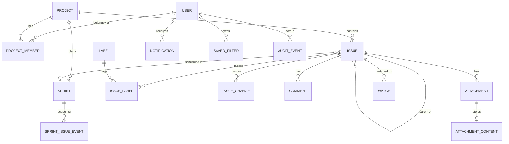

# Data Model: Issue Tracker MVP

**Feature**: [spec.md](./spec.md) | **Plan**: [plan.md](./plan.md) | **Research**: [research.md](./research.md)

One SQL Server database, one `AppDbContext`. Tables are grouped by the module that owns them; other
modules reach them only through that module's contracts (research R4). Conventions:

- Primary keys are `bigint` identity unless noted; users use `uniqueidentifier` (Identity default).
- Timestamps are `datetimeoffset` in UTC (research R21); calendar dates are `date`.
- Enums are stored as `varchar` names for readable data and stable migrations.
- `rowversion` columns are EF Core concurrency tokens (research R11).
- "Soft-deleted" rows are hidden by EF global query filters (research R13).
- Text length limits come from the spec (FR-017, FR-019, FR-033) and are enforced both by
  validation and by column sizes.



## Identity module

### User (`AspNetUsers`, extends `IdentityUser<Guid>`)

| Field | Type | Rules |
|-------|------|-------|
| Id | uniqueidentifier | PK |
| UserName / NormalizedUserName | nvarchar(64) | required, unique; 3–64 chars of letters, digits, `.`, `-`, `_` |
| Email / NormalizedEmail | nvarchar(256) | required, unique, valid email |
| DisplayName | nvarchar(100) | required, 1–100 chars |
| TimeZoneId | varchar(64) null | valid IANA ID; null = organization default (FR-051) |
| OrganizationRole | varchar(20) | `Administrator` or `User` (FR-008) |
| IsActive | bit | default 1 (FR-007) |
| DeactivatedAt | datetimeoffset null | set on deactivate, cleared on reactivate |
| MustChangePassword | bit | 1 after creation or admin reset (FR-003, FR-007) |
| EmailNotificationsEnabled | bit | default 1 (FR-057) |
| CreatedAt, LastSignInAt | datetimeoffset | |
| PasswordHash, SecurityStamp, ConcurrencyStamp, LockoutEnd, LockoutEnabled, AccessFailedCount | Identity | lockout: 5 failures → 15 min (FR-004) |

- **Invariants**: at least one user with `OrganizationRole = Administrator` and `IsActive = 1` must
  always exist (FR-007, US6 scenario 7); checked in the service inside a serializable transaction.
- **State**: `Active ⇄ Deactivated`. Deactivation rotates `SecurityStamp` (ends sessions within one
  minute) and removes the user from assignee pickers; existing references stay (edge case
  "Deactivated or removed assignee").
- External logins (`AspNetUserLogins`) are unused in the MVP and reserved for company SSO.

### AuditEvent (`AuditEvents`), append-only

| Field | Type | Rules |
|-------|------|-------|
| Id | bigint | PK |
| OccurredAt | datetimeoffset | required |
| EventType | varchar(40) | `SignInSucceeded`, `SignInFailed`, `LockedOut`, `PasswordChanged`, `PasswordReset`, `UserCreated`, `UserDeactivated`, `UserReactivated`, `OrganizationRoleChanged`, `ProjectMemberAdded`, `ProjectMemberRemoved`, `ProjectRoleChanged`, `MalwareDetected`, `AttachmentPurged`, `ProjectArchived`, `ProjectRestored`, `IssueRestored`, `SettingsChanged` |
| ActorUserId | uniqueidentifier null | null for failed sign-in with an unknown username |
| SubjectUserId | uniqueidentifier null | the user affected, if any |
| ProjectId | bigint null | |
| Target | nvarchar(200) | human-readable target (e.g. username attempted, file name) |
| Details | nvarchar(2000) | JSON; never passwords, tokens, or issue text |
| SourceIp | varchar(45) null | |

- Indexes: `(OccurredAt DESC)`, `(SubjectUserId, OccurredAt)`, `(ActorUserId, OccurredAt)`,
  `(EventType, OccurredAt)` for the FR-011 filters.
- Append-only: an `INSTEAD OF UPDATE, DELETE` trigger raises an error (research R12).

### OrganizationSettings (`OrganizationSettings`), single row (`Id = 1`)

| Field | Type | Rules |
|-------|------|-------|
| DefaultTimeZoneId | varchar(64) | valid IANA ID (FR-051) |
| IdleTimeoutMinutes | int | 5–480, default 30 (FR-005) |
| SetupCompletedAt | datetimeoffset null | set by first-run setup; `/setup` is closed once set (FR-002) |
| RowVersion | rowversion | |

## Projects module

### Project (`Projects`)

| Field | Type | Rules |
|-------|------|-------|
| Id | bigint | PK |
| Key | varchar(10) | required, unique, `^[A-Z][A-Z0-9]{1,9}$`, **immutable** (FR-012, FR-013) |
| Name | nvarchar(80) | required, unique (case-insensitive) |
| Description | nvarchar(2000) null | |
| BoardStyle | varchar(10) | `Kanban` or `Scrum` (FR-012); changeable only while no sprint is Active (edge case) |
| NextIssueNumber | int | starts at 1; incremented atomically on issue creation (research R9) |
| IsArchived, ArchivedAt | bit, datetimeoffset null | archived = read-only, hidden by default (FR-015) |
| CreatedAt, CreatedById | datetimeoffset, uniqueidentifier | |
| RowVersion | rowversion | |

- **State**: `Active ⇄ Archived` (Administrators only; audited).

### ProjectMember (`ProjectMembers`)

| Field | Type | Rules |
|-------|------|-------|
| ProjectId + UserId | bigint + uniqueidentifier | composite PK |
| Role | varchar(20) | `ProjectAdmin`, `Member`, `Viewer` (FR-009) |
| AddedAt, AddedById | datetimeoffset, uniqueidentifier | |

- Only active users can be added. Removing a member does not change issues they are assigned to;
  those issues show the person as "no longer a member" (edge case). Index: `(UserId)` for "projects I
  can access" (FR-016).

## Issues module

### Issue (`Issues`)

| Field | Type | Rules |
|-------|------|-------|
| Id | bigint | PK (integer key also serves the full-text index) |
| ProjectId | bigint | FK → Projects |
| Number | int | unique per project (research R9) |
| Key | varchar(21) | unique; `{Project.Key}-{Number}`; immutable (FR-018) |
| Type | varchar(10) | `Epic`, `Story`, `Task`, `Bug`, `Subtask` (FR-017) |
| Summary | nvarchar(255) | required, trimmed, 1–255 chars |
| Description | nvarchar(max) null | Markdown, ≤ 32,000 chars (FR-017) |
| Status | varchar(12) | `ToDo`, `InProgress`, `InReview`, `Done`; default `ToDo` (FR-021) |
| Priority | varchar(8) | `Highest`, `High`, `Medium`, `Low`, `Lowest`; default `Medium` (FR-019) |
| AssigneeId | uniqueidentifier null | when set: an active contributor of the project at assignment time |
| ReporterId | uniqueidentifier | creator; not editable |
| ParentId | bigint null | FK → Issues; hierarchy rules below (FR-020) |
| SprintId | bigint null | FK → Sprints; Scrum projects only |
| Rank | varchar(64) BIN2 collation | fractional index (research R10) |
| DueDate | date null | calendar date (FR-051) |
| Estimate | decimal(4,1) null | 0–999, at most one decimal place (FR-019) |
| CreatedAt, UpdatedAt | datetimeoffset | `UpdatedAt` changes on every recorded change |
| ResolvedAt | datetimeoffset null | set on entering Done, cleared on leaving (FR-022) |
| IsDeleted, DeletedAt, DeletedById | bit, datetimeoffset null, uniqueidentifier null | soft delete (FR-025) |
| RowVersion | rowversion | |

**Hierarchy rules (FR-020)**

- `Epic`: `ParentId` must be null.
- `Story`, `Task`, `Bug`: parent optional; if set, it must be an Epic in the same project.
- `Subtask`: parent required; it must be a Story, Task, or Bug in the same project. The sub-task's
  `SprintId` always equals its parent's (edge case "Sprint membership").
- Type changes are allowed only among Story, Task, and Bug (edge case "Changing issue type").

**Status transitions (FR-021, FR-022)**

```text
ToDo ⇄ InProgress ⇄ InReview ⇄ Done   (any status → any other status is allowed)
entering Done  → ResolvedAt = now
leaving Done   → ResolvedAt = null  (reopened)
parent → Done with open sub-tasks → allowed, result carries a warning listing them
```

**Indexes** (all filtered on `IsDeleted = 0` where useful)

- Unique `(ProjectId, Number)`, unique `(Key)`.
- `(ProjectId, Status, Rank)`: board columns (FR-028, FR-029).
- `(ProjectId, SprintId, Rank)`: backlog and sprint lists (FR-038).
- `(ProjectId, UpdatedAt DESC)`: issue list default order (FR-026).
- `(AssigneeId, Status)` including `ProjectId`: My Work and "assignee = me" (FR-049).
- `(ParentId)`, `(ProjectId, ResolvedAt)`: sub-task lists; Done column's 14-day window.
- **Full-text** index on `(Summary, Description)` (research R14).

### Label (`Labels`) and IssueLabel (`IssueLabels`)

| Field | Type | Rules |
|-------|------|-------|
| Label.Id | bigint | PK |
| Label.Name | nvarchar(50) | 1–50 chars; letters, digits, `-`, `_`, `.`; no spaces |
| Label.NormalizedName | nvarchar(50) | upper-invariant; **unique**, so "Backend" = "backend" (FR-027) |
| IssueLabel.IssueId + LabelId | bigint + bigint | composite PK; index `(LabelId, IssueId)` |

Labels are organization-wide and created on first use; suggestions are a prefix search on
`NormalizedName` (top 10).

### IssueChange (`IssueChanges`), append-only history

| Field | Type | Rules |
|-------|------|-------|
| Id | bigint | PK |
| IssueId | bigint | FK → Issues |
| ChangeSetId | uniqueidentifier | groups the changes of one user action |
| ActorId | uniqueidentifier | |
| OccurredAt | datetimeoffset | |
| Field | varchar(30) | `Created`, `Summary`, `Description`, `Type`, `Status`, `Priority`, `Assignee`, `Labels`, `DueDate`, `Estimate`, `Parent`, `Sprint`, `Rank`, `CommentAdded`, `CommentEdited`, `CommentDeleted`, `AttachmentAdded`, `AttachmentRemoved`, `Deleted`, `Restored` |
| OldValue, NewValue | nvarchar(max) null | display snapshots (e.g. user display name, "In Progress"); `Rank` records "higher"/"lower" |

- Index `(IssueId, OccurredAt)`. Append-only trigger (research R12). Written in the same transaction
  as the change (FR-037, SC-004).

### Attachment (`Attachments`) and AttachmentContent (`AttachmentContents`)

| Field | Type | Rules |
|-------|------|-------|
| Id | bigint | PK |
| IssueId | bigint | FK → Issues |
| FileName | nvarchar(255) | sanitized (no path segments); duplicates allowed |
| ContentType | varchar(100) | derived from the verified signature, not the browser's claim |
| SizeBytes | int | 1 – 10,485,760 (FR-053) |
| Sha256 | binary(32) | integrity check and scanner cache key |
| UploadedById, UploadedAt | uniqueidentifier, datetimeoffset | |
| ScanStatus | varchar(10) | `Pending` (shown as "being checked"), `Clean` (passed), `Blocked` (FR-054) |
| ScanAttempts, NextScanAt, ScannedAt | int, datetimeoffset null, datetimeoffset null | retry with backoff |
| ScanSignature | nvarchar(200) null | malware name when blocked |
| IsRemoved, RemovedAt, RemovedById | bit, … | hidden from users, retained (FR-056) |
| PurgedAt, PurgedById | datetimeoffset null, uniqueidentifier null | content row deleted; metadata kept (FR-056) |
| AttachmentContent.AttachmentId | bigint | PK/FK |
| AttachmentContent.Content | varbinary(max) | the file bytes (research R16) |

**Allowed types (FR-053)**: `.png`, `.jpg`/`.jpeg`, `.gif`, `.webp`, `.pdf`, `.docx`, `.xlsx`,
`.pptx`, `.txt`, `.log`, `.csv`. The extension must match the verified file signature.

**Scan state machine**

```text
Pending ──scan clean──▶ Clean
Pending ──malware────▶ Blocked   (audit MalwareDetected, notify uploader; never downloadable)
Pending ──scanner error/unreachable──▶ Pending (retry: 1 min, doubling, max 30 min interval)
any ──remove──▶ IsRemoved = 1 ; any ──purge (Administrator)──▶ content deleted, audit AttachmentPurged
```

Downloads require: view access to the issue, `ScanStatus = Clean`, not removed, not purged, and an
active user (edge case "Deactivated users").

## Collaboration module

### Comment (`Comments`)

| Field | Type | Rules |
|-------|------|-------|
| Id | bigint | PK (full-text key) |
| IssueId | bigint | FK → Issues |
| AuthorId | uniqueidentifier | only the author can edit or delete (FR-033) |
| Body | nvarchar(max) | Markdown, 1–32,000 chars |
| CreatedAt | datetimeoffset | |
| EditedAt | datetimeoffset null | non-null → shown as "edited" |
| IsDeleted, DeletedAt | bit, datetimeoffset null | shown as a "comment deleted" placeholder |
| RowVersion | rowversion | |

- Index `(IssueId, CreatedAt)`; **full-text** index on `Body` (FR-046).

### Watch (`Watches`)

| Field | Type | Rules |
|-------|------|-------|
| IssueId + UserId | bigint + uniqueidentifier | composite PK; index `(UserId)` |
| CreatedAt | datetimeoffset | |

Created automatically for the reporter, the assignee (on assignment), and commenters (FR-035).

### Notification (`Notifications`)

| Field | Type | Rules |
|-------|------|-------|
| Id | bigint | PK |
| RecipientId | uniqueidentifier | never equal to ActorId (FR-036) |
| ActorId | uniqueidentifier | |
| IssueId | bigint | |
| Type | varchar(20) | `Assigned`, `Mentioned`, `Commented`, `StatusChanged` |
| Text | nvarchar(300) | snapshot, e.g. "Ali assigned PAY-12 to you" |
| CreatedAt | datetimeoffset | |
| ReadAt | datetimeoffset null | |
| EmailOutboxMessageId | bigint null | set when an email was queued (Assigned, Mentioned only) |

- Index `(RecipientId, ReadAt, CreatedAt DESC)` for the unread count and list.
- Recipients must still be able to see the issue when the notification is created.

### EmailOutboxMessage (`EmailOutbox`)

| Field | Type | Rules |
|-------|------|-------|
| Id | bigint | PK |
| RecipientUserId | uniqueidentifier | |
| ToAddress | nvarchar(256) | |
| Subject | nvarchar(200) | issue key + summary + event (FR-057) |
| BodyText, BodyHtml | nvarchar(max) | no description or comment text (FR-057) |
| Status | varchar(10) | `Pending`, `Sent`, `Expired` |
| CreatedAt, NextAttemptAt, SentAt | datetimeoffset | |
| Attempts | int | |
| LastError | nvarchar(1000) null | |

- **State**: `Pending → Sent`, or `Pending → Expired` once `CreatedAt + 24 h` passes without success
  (FR-058). Index `(Status, NextAttemptAt)`.

## Planning module

### Sprint (`Sprints`)

| Field | Type | Rules |
|-------|------|-------|
| Id | bigint | PK |
| ProjectId | bigint | FK → Projects (Scrum projects only) |
| Sequence | int | per project, unique `(ProjectId, Sequence)` |
| Name | nvarchar(60) | default `"{Key} Sprint {Sequence}"` (FR-040) |
| Goal | nvarchar(500) null | |
| State | varchar(10) | `Planned`, `Active`, `Completed` |
| StartDate, EndDate | date null | required to start; `EndDate > StartDate`; default end = start + 14 days (FR-041) |
| StartedAt, CompletedAt | datetimeoffset null | |
| RowVersion | rowversion | |

- **Filtered unique index** `(ProjectId) WHERE State = 'Active'`: at most one active sprint per
  project, enforced by the database (FR-041, US4 scenario 4).
- **State**: `Planned → Active → Completed`; completed sprints are read-only (FR-043).

### SprintIssueEvent (`SprintIssueEvents`), sprint scope log for the report

| Field | Type | Rules |
|-------|------|-------|
| Id | bigint | PK |
| SprintId | bigint | FK → Sprints |
| IssueId | bigint | |
| EventType | varchar(20) | `CommittedAtStart`, `Added`, `Removed`, `Completed`, `NotCompleted` |
| Estimate | decimal(4,1) null | estimate at the time of the event |
| OccurredAt | datetimeoffset | |

- Written on start (one `CommittedAtStart` per issue), on moves in/out of an active sprint
  (`Added`/`Removed`), and on completion (`Completed` or `NotCompleted` per issue, judged by the
  issue's own status). The sprint report (FR-044) is computed from these rows. Sub-tasks are not
  counted separately.

## Search module

### SavedFilter (`SavedFilters`)

| Field | Type | Rules |
|-------|------|-------|
| Id | bigint | PK |
| OwnerId | uniqueidentifier | private to owner (FR-048) |
| Name | nvarchar(80) | unique per owner |
| CriteriaJson | nvarchar(4000) | serialized `IssueSearchCriteria` (see contracts) |
| CreatedAt, UpdatedAt | datetimeoffset | |

### RecentIssueView (`RecentIssueViews`)

| Field | Type | Rules |
|-------|------|-------|
| UserId + IssueId | uniqueidentifier + bigint | composite PK |
| ViewedAt | datetimeoffset | index `(UserId, ViewedAt DESC)`; only the latest 10 per user are kept (FR-049) |

## Infrastructure tables

- `DataProtectionKeys` (EF Core data protection store; research R25).
- `__EFMigrationsHistory`.

## Derived views (no tables)

- **Board** (FR-028–FR-031): issues of a project grouped by `Status`, ordered by `Rank`; Kanban
  excludes Epics and shows Done only when `ResolvedAt ≥ now − 14 days`; Scrum shows only issues whose
  `SprintId` is the active sprint.
- **Backlog** (FR-038): open, non-Epic, non-Sub-task issues with `SprintId IS NULL`, ordered by `Rank`,
  plus planned and active sprints with their issues.
- **Open issue**: `Status <> 'Done'` and `IsDeleted = 0`.
