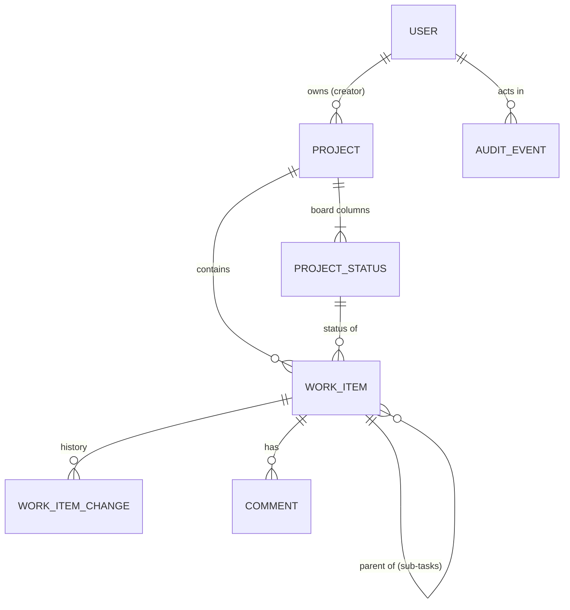

# Data Model: Core Kanban Project (Phase 1)

**Feature**: [spec.md](./spec.md) | **Plan**: [plan.md](./plan.md) | **Research**: [research.md](./research.md)

One SQL Server database, one `AppDbContext`. Tables are grouped by owning module (research R4).

Conventions: primary keys are `bigint` identity (users use `uniqueidentifier`, the Identity default);
timestamps are UTC `datetimeoffset`; enums are stored as `varchar` names; `rowversion` columns are
concurrency tokens; soft-deleted rows are hidden by global query filters.



## Identity module

### User (`AspNetUsers`, extends `IdentityUser<Guid>`)

| Field | Type | Rules |
|-------|------|-------|
| Id | uniqueidentifier | PK |
| UserName / NormalizedUserName | nvarchar(64) | required, unique; 3–64 letters, digits, `.`, `-`, `_` |
| Email / NormalizedEmail | nvarchar(256) | required, unique, valid email |
| DisplayName | nvarchar(100) | required, 1–100 characters (FR-007) |
| TimeZoneId | varchar(64) null | valid IANA ID; null = organization default (FR-007, FR-043) |
| OrganizationRole | varchar(20) | `Administrator` or `User` (FR-008) |
| IsActive | bit | default 1; deactivation sets 0 (FR-004) |
| DeactivatedAt | datetimeoffset null | |
| MustChangePassword | bit | 1 after creation or reset (FR-003, FR-004) |
| CreatedAt, LastSignInAt | datetimeoffset | |
| PasswordHash, SecurityStamp, ConcurrencyStamp, LockoutEnd, LockoutEnabled, AccessFailedCount | Identity | lockout: 5 failures → 15 minutes (FR-005) |

- **State**: `Active ⇄ Deactivated`. Deactivation rotates `SecurityStamp`, ending open sessions within
  one minute (research R6). At least one active Administrator must always exist.

### AuditEvent (`AuditEvents`), append-only

| Field | Type | Rules |
|-------|------|-------|
| Id | bigint | PK |
| OccurredAt | datetimeoffset | required |
| EventType | varchar(40) | `SetupCompleted`, `SignInSucceeded`, `SignInFailed`, `LockedOut`, `PasswordChanged`, `PasswordReset`, `UserCreated`, `UserDeactivated`, `UserReactivated` (FR-010) |
| ActorUserId | uniqueidentifier null | null for failed sign-in with an unknown username |
| SubjectUserId | uniqueidentifier null | the account affected |
| Target | nvarchar(200) | for example the username attempted |
| Details | nvarchar(2000) | JSON; never passwords or tokens |
| SourceIp | varchar(45) null | |

- Indexes `(OccurredAt DESC)`, `(SubjectUserId, OccurredAt)`. An `INSTEAD OF UPDATE, DELETE` trigger
  makes the table append-only.

### OrganizationSettings (`OrganizationSettings`), single row (`Id = 1`)

| Field | Type | Rules |
|-------|------|-------|
| DefaultTimeZoneId | varchar(64) | valid IANA ID; seeded `UTC` |
| IdleTimeoutMinutes | int | seeded 30 (FR-006); editable in a later phase |
| SetupCompletedAt | datetimeoffset null | set by first-run setup; `/setup` closes once set (FR-002) |
| RowVersion | rowversion | |

## Projects module

### Project (`Projects`)

| Field | Type | Rules |
|-------|------|-------|
| Id | bigint | PK |
| Key | varchar(10) | required, unique, `^[A-Z][A-Z0-9]{1,9}$`, **immutable** (FR-011, FR-012) |
| Name | nvarchar(80) | required, 1–80 characters |
| NormalizedName | nvarchar(80) | upper-invariant; **unique** (names unique ignoring case) |
| Description | nvarchar(2000) null | plain text (FR-011) |
| OwnerId | uniqueidentifier | FK → Users; the creator (FR-011); becomes first Project Admin in Phase 2 |
| NextItemNumber | int | starts at 1; incremented atomically on work item creation (research R13) |
| BoardVersion | int | starts at 1; incremented on every column change (research R11) |
| CreatedAt, UpdatedAt | datetimeoffset | |
| RowVersion | rowversion | guards edits to name and description |

### ProjectStatus (`ProjectStatuses`): a board column

| Field | Type | Rules |
|-------|------|-------|
| Id | bigint | PK |
| ProjectId | bigint | FK → Projects |
| Name | nvarchar(30) | 1–30 characters (FR-034) |
| NormalizedName | nvarchar(30) | upper-invariant; unique per project `(ProjectId, NormalizedName)` |
| Category | varchar(12) | `ToDo`, `InProgress` or `Done` (shown as "to do", "in progress", "done") |
| Position | int | 0-based order on the board; consecutive per project (kept by the domain) |
| WipLimit | int null | 1–99 when set (FR-036) |

**Board rules** (enforced by the `Project` aggregate; research R11):

- A new project gets `To Do` (`ToDo`, 0), `In Progress` (`InProgress`, 1), `Done` (`Done`, 2) (FR-016).
- 1–10 statuses per project (FR-034); at least one `ToDo` and one `Done` always remain (FR-038).
- `Category` can change only while no work item (including soft-deleted ones) has that status (FR-039).
- Deleting a status requires a destination status in the same project; every work item with the deleted
  status (sub-tasks and soft-deleted items included) moves there first, each move recorded in its
  history with the note "column deleted"; then the row is removed (FR-037).
- Every add, rename, move, limit change, category change or deletion increments
  `Project.BoardVersion`; commands carry the expected version (FR-041).

## Work module

### WorkItem (`WorkItems`): tasks and sub-tasks

| Field | Type | Rules |
|-------|------|-------|
| Id | bigint | PK |
| ProjectId | bigint | FK → Projects |
| Number | int | unique per project |
| Key | varchar(21) | unique; `{Project.Key}-{Number}`; immutable (FR-024) |
| Type | varchar(12) | `Task` or `Subtask` in Phase 1 (research R12) |
| ParentId | bigint null | FK → WorkItems; required for `Subtask` (a `Task` in the same project); null for `Task` |
| Title | nvarchar(255) | required, trimmed, 1–255 characters (FR-025) |
| Description | nvarchar(max) null | plain text, at most 32,000 characters (FR-025) |
| Priority | varchar(8) | `Highest`, `High`, `Medium`, `Low`, `Lowest`; default `Medium` |
| StatusId | bigint | FK → ProjectStatuses of the same project |
| Rank | varchar(64), binary collation | fractional index (research R14) |
| CreatedById | uniqueidentifier | the creator; may delete the item (FR-033) |
| CreatedAt, UpdatedAt | datetimeoffset | `UpdatedAt` changes with every recorded change |
| ResolvedAt | datetimeoffset null | set when entering a `Done` status, cleared when leaving (FR-027) |
| IsDeleted, DeletedAt, DeletedById | bit, datetimeoffset null, uniqueidentifier null | soft delete (FR-033) |
| RowVersion | rowversion | |

**Rules**

- Hierarchy: a `Subtask` must have a `Task` parent in the same project and cannot be a parent itself
  (FR-028).
- New tasks created inline start in the column where they were typed, ranked after its last card;
  sub-tasks start in the leftmost `ToDo` status, ranked after their last sibling, and are listed in
  their parent's drawer in rank order (FR-018, FR-028, FR-040).
- Moving a task to a `Done` status with open sub-tasks is allowed; the result carries a warning listing
  them (FR-029).
- Deleting a task soft-deletes its sub-tasks in the same change set; restoring it restores them
  (FR-033).

**Status transitions**

```text
any status ──move──▶ any other status of the same project
entering a Done-category status → ResolvedAt = now
leaving a Done-category status  → ResolvedAt = null
```

**Indexes** (filtered on `IsDeleted = 0` where useful)

- Unique `(ProjectId, Number)` and unique `(Key)`.
- `(ProjectId, StatusId, Rank)` where `ParentId IS NULL`: the board (research R19).
- `(ParentId)`: sub-task lists and done/total counts.
- `(ProjectId, ResolvedAt)`: the 14-day window of done columns (FR-021).

### WorkItemChange (`WorkItemChanges`), append-only history

| Field | Type | Rules |
|-------|------|-------|
| Id | bigint | PK |
| WorkItemId | bigint | FK → WorkItems |
| ChangeSetId | uniqueidentifier | groups the changes of one user action |
| ActorId | uniqueidentifier | |
| OccurredAt | datetimeoffset | |
| Field | varchar(30) | `Created`, `Title`, `Description`, `Priority`, `Status`, `Rank`, `SubtaskAdded`, `CommentAdded`, `CommentEdited`, `CommentDeleted`, `Deleted`, `Restored` |
| OldValue, NewValue | nvarchar(max) null | display snapshots (for example status names) |
| Note | nvarchar(200) null | for example "column deleted" |

- Index `(WorkItemId, OccurredAt)`. Append-only trigger (research R17). Written in the same
  transaction as the change (FR-031, SC-004).
- A reorder within a column records `Rank`, with the card's 1-based position in the column before and
  after as old and new values and a note such as "moved above WEB-3", "moved to top" or "moved to
  bottom"; a move to another column records only `Status`; rank rebalancing (research R14) keeps the
  order and records nothing (FR-031, constitution IV).

### Comment (`Comments`)

| Field | Type | Rules |
|-------|------|-------|
| Id | bigint | PK |
| WorkItemId | bigint | FK → WorkItems |
| AuthorId | uniqueidentifier | only the author can edit or delete (FR-030) |
| Body | nvarchar(max) | plain text, 1–32,000 characters |
| CreatedAt | datetimeoffset | |
| EditedAt | datetimeoffset null | non-null → shown as edited |
| IsDeleted, DeletedAt | bit, datetimeoffset null | shown as "comment deleted" |
| RowVersion | rowversion | |

- Index `(WorkItemId, CreatedAt)`; listed oldest first.

## Infrastructure tables

- `DataProtectionKeys` (research R25) and `__EFMigrationsHistory`.

## Derived views (no tables)

- **Board**: a project's statuses in `Position` order, each with its top-level, non-deleted work items
  in `Rank` order; `Done`-category statuses include only items resolved in the last 14 days unless "show
  all" is chosen; each card carries its sub-tasks' done/total counts; each column carries its card count
  (the cards it shows) and whether that count exceeds `WipLimit`.
- **Open work item**: its status's category is not `Done`, and it is not deleted. A project's "open
  tasks" count (FR-013) counts its open work items, sub-tasks included.
- **Lists**: project, account and deleted-task lists are paged 50 at a time with a total count;
  sub-tasks, comments and history in the drawer load 50 at a time (constitution performance baseline).

## Planned additive changes (later phases; not built in Phase 1)

The Phase 1 schema is designed so the later phases only add tables and nullable columns (research
R26):

| Phase | Addition | Effect on Phase 1 data |
|-------|----------|------------------------|
| 2 | `ProjectMembers(ProjectId, UserId, Role)` | none; each `Projects.OwnerId` is inserted as a Project Admin |
| 2 | `WorkItems.AssigneeId`, `StartDate`, `DueDate` (nullable) | none |
| 3 | `Portfolios`; `Projects.PortfolioId` (nullable) | none |
| 3 | `Projects.Template` (default `Kanban`) | existing projects become Kanban projects |
| 3 | new `WorkItems.Type` values: Epic, Story, Bug, Phase, Milestone | existing `Task`/`Subtask` rows unchanged |
| 3 | `Sprints`; `WorkItems.SprintId` (nullable) | none |
| 3 | `Dependencies`, stage-gate approvals | none |
