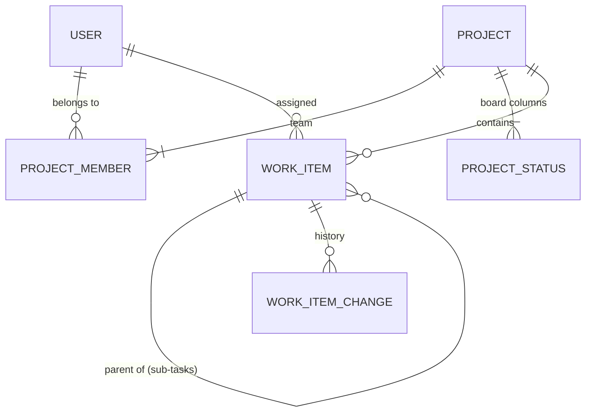

# Data Model: Project Views and Team (Phase 2)

**Feature**: [spec.md](./spec.md) | **Plan**: [plan.md](./plan.md) | **Research**: [research.md](./research.md)

Phase 2 changes the Phase 1 model (`specs/002-kanban-project-core/data-model.md`) only by adding: one table,
one column on `Projects`, three nullable columns on `WorkItems`, new enum values and new indexes. No Phase 1
column changes meaning, except that `Projects.OwnerId` no longer grants rights (it records the creator).

## Projects module

### ProjectMember (`ProjectMembers`): new

| Field | Type | Rules |
|-------|------|-------|
| Id | bigint | PK |
| ProjectId | bigint | FK → Projects (cascade, owned by the aggregate) |
| UserId | uniqueidentifier | FK → Users (restrict); **unique per project** `(ProjectId, UserId)` |
| Role | varchar(12) | `ProjectAdmin`, `Member` or `Viewer` (FR-001) |
| AddedAt | datetimeoffset | |
| AddedById | uniqueidentifier null | FK → Users; null for memberships created by the Phase 2 upgrade |

Indexes: unique `(ProjectId, UserId)`; `(UserId)` including `Role`, for the project list and "My tasks".

### Project (`Projects`): changed

| Field | Type | Rules |
|-------|------|-------|
| MembersVersion | int | **new**; starts at 1; incremented by every membership change; concurrency token (FR-013) |
| OwnerId | uniqueidentifier | unchanged column; now only records the creator, who becomes the first Project Admin |

**Team rules** (enforced by the `Project` aggregate; research R1):

- Creating a project adds its creator as `ProjectAdmin` (FR-007).
- A person holds at most one membership per project; adding an existing member is refused
  (`DuplicateMember`, naming their current role).
- Only active accounts can be added (checked by the service through `IUserDirectory`;
  `AccountDeactivated`).
- A role change or removal that would reduce the number of `ProjectAdmin` members with active accounts to
  zero is refused (`LastProjectAdmin`) (FR-010). Removing or retyping an inactive Project Admin is always
  allowed, so a project whose Project Admins were all deactivated can be repaired by an administrator.
- Every add, role change or removal increments `MembersVersion`; commands carry the expected version, and
  a mismatch is a `Conflict` returning the current team (FR-013). A role change to the same role changes
  nothing.

### Project roles and rights

| Role | View | Contribute (create, edit, move, assign, schedule, comment) | Delete own items | Manage (details, columns, members, delete any item) |
|------|:----:|:----:|:----:|:----:|
| Viewer | ✅ | | | |
| Member | ✅ | ✅ | ✅ | |
| ProjectAdmin | ✅ | ✅ | ✅ | ✅ |
| Administrator (organization, member or not) | ✅ | ✅ | ✅ | ✅ (and restore deleted items) |

People who are neither members nor administrators cannot see the project at all (FR-002). See
[contracts/permissions.md](./contracts/permissions.md).

## Work module

### WorkItem (`WorkItems`): changed

| Field | Type | Rules |
|-------|------|-------|
| AssigneeId | uniqueidentifier null | **new**; FK → Users (restrict); must be an active `ProjectAdmin` or `Member` of the project **when assigned** (FR-016); kept if they later leave, become a Viewer or are deactivated (FR-024) |
| StartDate | date null | **new**; 2000-01-01 to 2099-12-31 (FR-018) |
| DueDate | date null | **new**; 2000-01-01 to 2099-12-31; not before `StartDate` when both are set (FR-018) |

A check constraint `CK_WorkItems_Dates` enforces the date rules in the database as well.

**Rules**

- Assigning, unassigning and changing dates are changes to the item: they update `UpdatedAt` and the row
  version, and they follow the conflict rules of Phase 1 (FR-023).
- `WorkItem.Assign(assignee)` records `Assignee` with the old and new display names as snapshots;
  `WorkItem.Schedule(start, due)` validates both dates together and records `StartDate` and `DueDate` rows
  (ISO `yyyy-MM-dd` values) in one change set, only for the dates that changed.
- **Overdue** (derived, not stored): the item is open (its status category is not `Done`) and `DueDate` is
  before the viewer's today (FR-020, research R9).
- **Scheduled** (derived): `StartDate` or `DueDate` is set. On the timeline a one-date item is a one-day bar.
- **Can still work** (derived at read time): the assignee is an active `ProjectAdmin` or `Member` of the
  project; otherwise the item shows the assignee marked as no longer able to work on the project (FR-024).

### WorkItemField (history): new values

`Assignee`, `StartDate`, `DueDate`, added to the Phase 1 values (FR-023).

### Indexes

| Index | Keys | Filter | Included columns | Serves |
|-------|------|--------|------------------|--------|
| `IX_WorkItems_Board` (changed) | ProjectId, StatusId, Rank | live top-level items | Key, Title, Priority, ResolvedAt, RowVersion, **AssigneeId, DueDate** | board cards (SC-002) |
| `IX_WorkItems_Project_Live` (new) | ProjectId, Number | `IsDeleted = 0` | Key, Title, ParentId, StatusId, Priority, AssigneeId, StartDate, DueDate, UpdatedAt, Rank, RowVersion | list and timeline |
| `IX_WorkItems_Assignee_Live` (new) | AssigneeId, ProjectId | `IsDeleted = 0 AND AssigneeId IS NOT NULL` | Key, Title, ParentId, StatusId, Priority, DueDate | "My tasks" |

## Identity module

### AuditEventType: new values

`MemberAdded`, `MemberRemoved`, `MemberRoleChanged` (FR-012). Target: the project key; subject: the
member; details: `{"Role":"Member"}` or `{"From":"Member","To":"Viewer"}`. Memberships created by the
upgrade are recorded as `MemberAdded` with no actor and `{"Role":…,"Source":"Phase 2 upgrade"}`.

## Upgrade (research R3)

The migration that creates `ProjectMembers` also, in one transaction:

1. inserts each project's `OwnerId` as `ProjectAdmin`;
2. inserts as `Member` every other person who created a work item in the project (deleted items
   included), appears as the actor of one of its work items' history rows, or wrote a comment on one of
   its work items (FR-014), including people whose accounts are now deactivated;
3. writes one `MemberAdded` audit event per inserted membership.

Both inserts skip memberships that already exist, so the script is safe to re-run.
